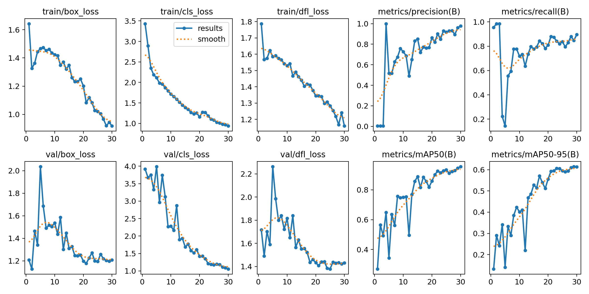
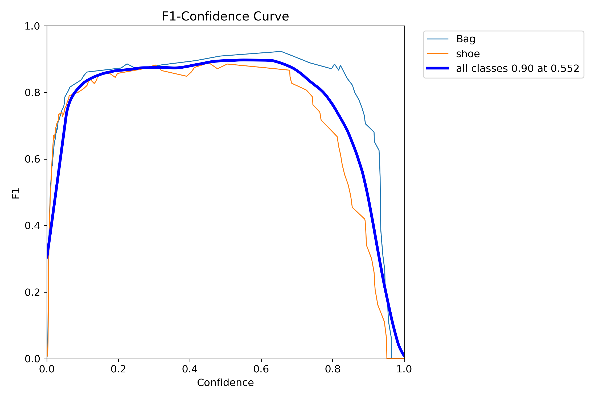
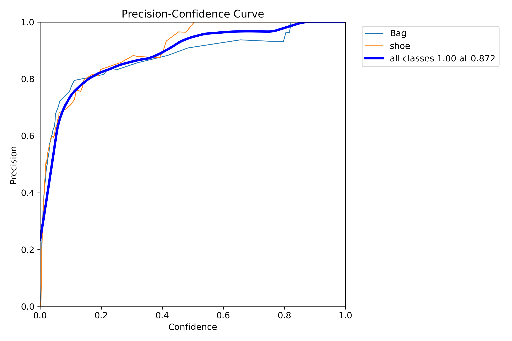
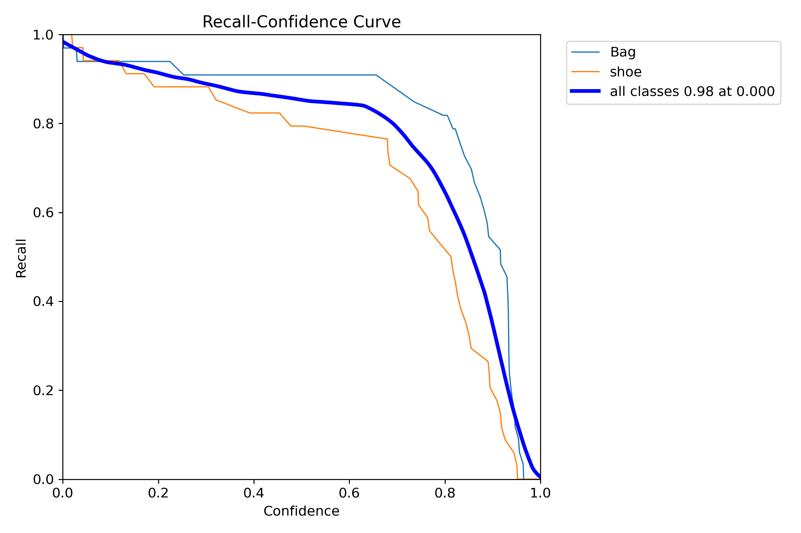
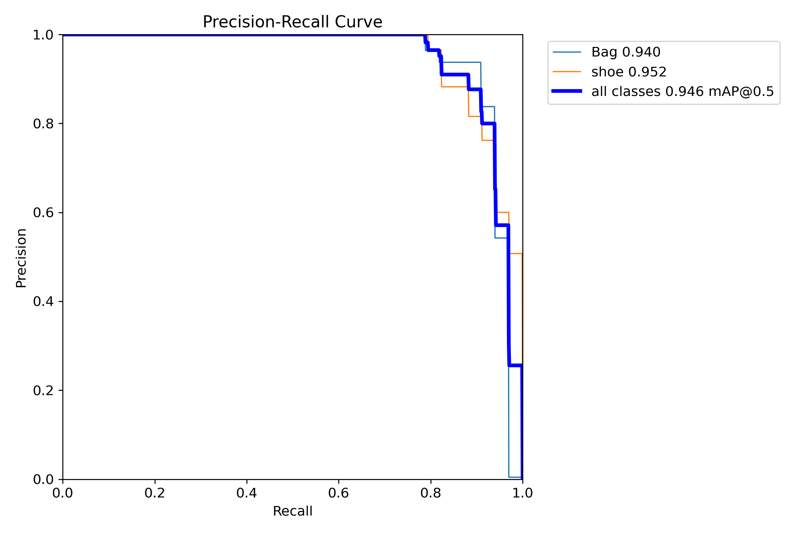
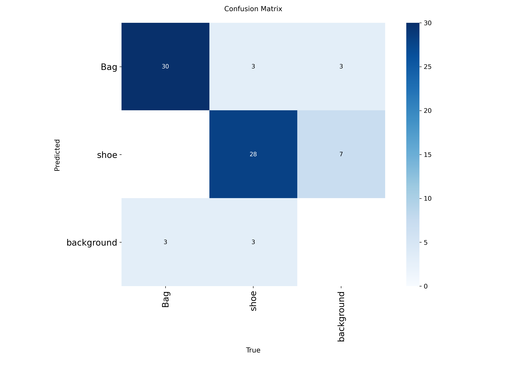
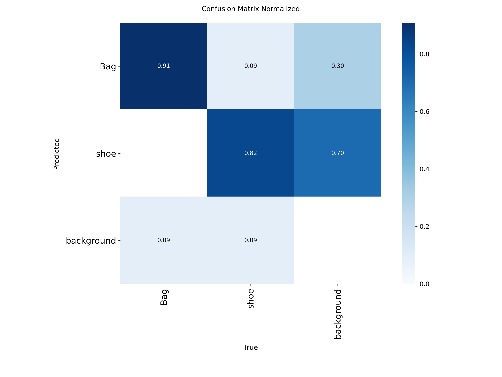

# Detección de Objetos en Tiempo Real con YOLOv8 y OpenCV

## Descripción del Proyecto

Este proyecto consiste en el desarrollo de un sistema de visión por computadora para la detección de objetos en tiempo real utilizando YOLOv8 y OpenCV.

El modelo fue entrenado con un dataset propio construido y etiquetado mediante Roboflow. Las categorías seleccionadas para la detección fueron:

* Bag (Bolso)
* Shoe (Zapato)

La aplicación final utiliza la cámara del computador para identificar los objetos entrenados en tiempo real mediante el modelo generado durante el proceso de entrenamiento.

---

## Tecnologías Utilizadas

* Python 3
* YOLOv8 (Ultralytics)
* OpenCV
* Google Colab
* Roboflow

---

## Construcción del Dataset

El dataset fue construido manualmente utilizando imágenes propias de las categorías seleccionadas:

* Bag (Bolso)
* Shoe (Zapato)

Posteriormente las imágenes fueron etiquetadas utilizando Roboflow en formato compatible con YOLO.

El dataset fue dividido en tres conjuntos:

* Entrenamiento (Train)
* Validación (Validation)
* Prueba (Test)

**Enlace del dataset** --> https://app.roboflow.com/yohans-workspace-nuedv/dataforobjets/train

---

## Entrenamiento del Modelo

El entrenamiento del modelo se realizó utilizando Google Colab, aprovechando el acceso a recursos de cómputo con GPU para acelerar el proceso de aprendizaje de la red neuronal.

Se utilizó la implementación de YOLOv8 proporcionada por la librería Ultralytics, entrenando el modelo sobre un dataset propio previamente construido y etiquetado mediante Roboflow.

## Entorno de Entrenamiento
Plataforma: Google Colab
Framework: Ultralytics YOLOv8
Lenguaje: Python
Aceleración: GPU de Google Colab
Notebook de Entrenamiento

El proceso completo de entrenamiento puede consultarse en el siguiente enlace:

https://colab.research.google.com/drive/1XtwLtF4I_yFdqtD86fvF6e97okAOQ7Jt?usp=sharing


### Modelo utilizado

YOLOv8n

### Archivo de pesos generado

El archivo **best.pt** contiene los pesos aprendidos por la red neuronal durante el entrenamiento y fue posteriormente integrado en la aplicación desarrollada con OpenCV para realizar detección de objetos en tiempo real.

### Evidencias del entrenamiento

#### Evolución del entrenamiento



#### Curva F1



#### Curva Precision-Confidence



#### Curva Recall-Confidence



#### Curva Precision-Recall



#### Matriz de Confusión



#### Matriz de Confusión Normalizada



---

## Métricas Obtenidas

### Resultados Generales

| Métrica   | Valor |
| --------- | ----- |
| Precision | 0.96  |
| Recall    | 0.848 |
| mAP@50    | 0.946 |
| mAP@50-95 | 0.617 |

### Resultados por Categoría

| Clase | Precision | Recall | mAP@50 | mAP@50-95 |
| ----- | --------- | ------ | ------ | --------- |
| Bag   | 0.92      | 0.909  | 0.940  | 0.740     |
| Shoe  | 1.00      | 0.786  | 0.952  | 0.493     |

---

## Explicación de las Métricas

### Precision

Indica el porcentaje de detecciones realizadas por el modelo que fueron correctas.

Una precisión de 96% significa que la mayoría de las predicciones realizadas corresponden efectivamente a las categorías entrenadas.

### Recall

Mide la capacidad del modelo para encontrar todos los objetos presentes en una imagen.

Un recall de 84.8% indica que el modelo detecta la mayoría de los objetos reales presentes en las imágenes.

### mAP@50

Representa la precisión promedio considerando una coincidencia mínima del 50% entre la predicción y la ubicación real del objeto.

El valor obtenido de 94.6% demuestra un excelente desempeño del modelo.

### mAP@50-95

Es una métrica más exigente que evalúa el modelo bajo diferentes niveles de coincidencia entre las predicciones y la realidad.

El resultado de 61.7% indica un desempeño sólido considerando la rigurosidad de esta métrica.

---

## Implementación

La aplicación fue desarrollada utilizando OpenCV para realizar detección de objetos en tiempo real mediante la cámara web.

Características:

* Captura de video en tiempo real.
* Detección automática de bolsos y zapatos.
* Visualización de cajas delimitadoras (Bounding Boxes).
* Etiquetado de cada objeto detectado.
* Visualización de la confianza de detección.

---

## Estructura del Proyecto

```text
project/
│
├── model/
│   └── best.pt
│
├── images/
│   ├── results.png
│   ├── confusion_matrix.png
│   ├── confusion_matrix_normalized.png
│   ├── F1_curve.png
│   ├── P_curve.png
│   ├── PR_curve.png
│   └── R_curve.png
│
├── examenFinal.py
├── requirements.txt
└── README.md
```

---

## Instalación

Clonar el repositorio:

```bash
git clone https://github.com/usuario/repositorio.git
```

Ingresar al proyecto:

```bash
cd repositorio
```

Instalar dependencias:

```bash
pip install -r requirements.txt
```

---

## Ejecución

Ejecutar:

```bash
python examenFinal.py
```

La aplicación abrirá la cámara web y comenzará la detección en tiempo real de las categorías entrenadas.

---

## Conclusiones

Se logró entrenar exitosamente un modelo YOLOv8 capaz de detectar las categorías Bag y Shoe en tiempo real.

Los resultados obtenidos muestran buena precisión y un desempeño adecuado para aplicaciones de visión por computadora, demostrando la efectividad del proceso completo de construcción del dataset, entrenamiento, evaluación e implementación del modelo.


